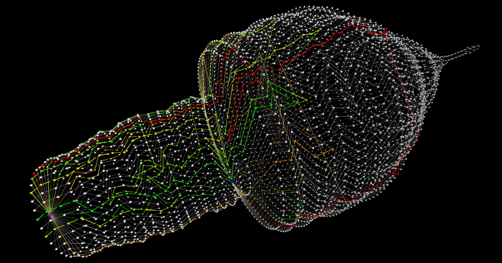
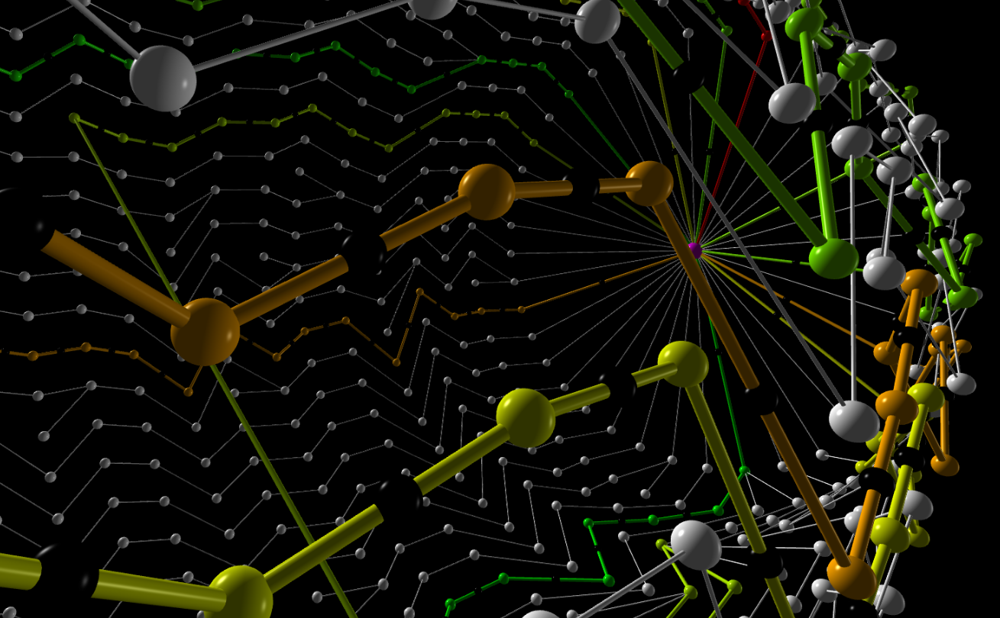

# lemin

## Summary

This project is about finding x edge disjoint paths with the smallest total cost in an undirected graph, so that n "ants" can move from a to b (vertices) in the smallest amount of move, assuming that only one ant can move on an edge at a time, and one vertex can only contain one "ant" (except for a and b).

> the graph is generated randomly by `/resources/generator` (works only on UNIX systems)

## How to launch

> you need a web browser to use the viewer (it will launch itself in a tab of your default browser)

* First, compile the C main program

  * UNIX systems :

    `make`

  * Microsoft Windows with mingw32 :

    `mingw32-make.exe`

* Next, you can run the program along with the viewer and a map file:

  * UNIX systems :
    `./lem-in < resources\test_big_superposition.txt | python visu/visu.py`
  * Microsoft Windows with unix syntax support :
    `lem-in.exe < resources\test_big_superposition.txt | python visu/visu.py`

## What you see

The viewer displays little black dots ("ants") following the paths of the solution found by the program. Each path is colored following its length (green -> red). The purple dot is the starting vertex (a), the blue dot is the ending vertex. 

## Controls

You can chose attach the camera to a random ant and change de speed in the menu below.

You can move the camera using the mouse and `Ctrl + leftClick` or `rightClick`.

You can move along the horizontal axis using the `A` and `D` keys.

## Preview

